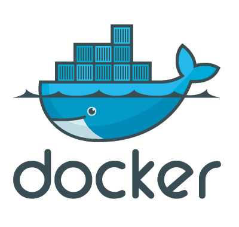

- title : Full Stack Web in F#
- author : Tomasz Heimowski
- theme : night
- transition : default

***

## Full Stack Web

# in F#

Tomasz Heimowski 

https://theimowski.com

 

*@theimowski*

***

## Full Stack Web

***

## TODO MVC

http://todomvc.com/

https://www.todobackend.com/

***

# F#

* Microsoft origin, OSS
* **General** purpose
* Functional-first
* .NET / Mono / .NET Core / Web **browser**
* https://fsharp.org/

***

***

## big picture

  

* Web stack
* Combines several OSS projects
* F# end-to-end
* Type-SAFE
* Cloud-ready
* Flexible

https://safe-stack.github.io

***

## Prerequisites

* [.NET SDK 2.2](https://www.microsoft.com/net)
* [FAKE 5](https://fake.build/) (global dotnet tool)
* [Node.js](https://nodejs.org/)
* [Yarn](https://yarnpkg.com/) or [NPM](https://www.npmjs.com/)

 
 

#### or

* [Docker](https://www.docker.com)
* [VS Code Insiders](https://code.visualstudio.com/insiders/)
* [VS Code Remote Containers](https://code.visualstudio.com/docs/remote/containers)

***

## Creating SAFE project

* Install SAFE template: `dotnet new -i SAFE.Template`
* Create project from template: `dotnet new SAFE`
* Build & run: `fake build --target run`
* Wait for build to finish: app opens up in browser

***

## S for Saturn

https://saturnframework.org/

* **Web server**
* ASP.NET Core, Kestrel

***

## A for Azure 

https://azure.microsoft.com

* **Cloud** provider

***

 

1. Azure AppService
1. Google Cloud AppEngine
1. Google Cloud Kubernetes Engine
1. IIS
1. Docker
1. Heroku

***

## F for Fable 

http://fable.io

* F# to **JavaScript compiler**
* Babel JS

***

## E for Elmish 

https://elmish.github.io

* **UI library**
* inspired by Elm

***

***

## practical benefits

  

* one language to rule them all
* after learning F# it's **really** easy to use!
* rich template with plenty options
* development experience taken to the next level
* Fable integrates nicely with JavaScript ecosystem
* Microsoft involvement
* community & commercial support

***

## what's more?

* [Sharing code](https://safe-stack.github.io/docs/feature-clientserver/) between Server and Client
* [Remote Devtools debugger](https://elmish.github.io/debugger/)
* [Full Stack Debugging in VS Code](https://safe-stack.github.io/docs/feature-debugging/)
* [Server-Side Rendering](https://safe-stack.github.io/docs/feature-ssr/) - Back-end React
* [ThoughtWorks Technology radar](https://www.thoughtworks.com/radar/languages-and-frameworks/safe-stack)
* Number of podcasts and [events](https://safe-stack.github.io/docs/events/) appearances

***

## resources

* [Docs](https://safe-stack.github.io/docs/) - SAFE in a nutshell
* Deep dive demo from [F# eXchange '18](https://skillsmatter.com/skillscasts/11308-safe-apps-with-f-web-stack) (video)
* [GitHub SAFE Stack org](https://github.com/SAFE-Stack/)
    * dotnet template (>23K NuGet downloads)
    * various sample apps
* Slides: https://theimowski.com/talk-full-stack-web-in-fsharp
* Source code: https://github.com/theimowski/SAFE-TodoMVC

***